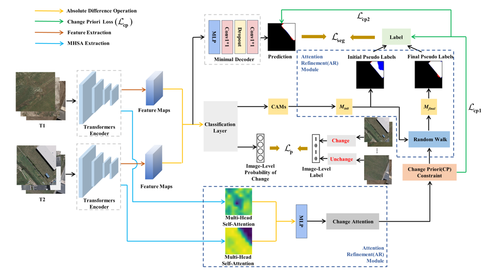

# ACWCD


## Prerequisite

- Python >= 3.8, pytorch >= 1.12.0

## Framework of the ACWCD




## Usage

### A: Prepare the dataset

- **Option 1**: You can downland [BCD](https://study.rsgis.whu.edu.cn/pages/download/building_dataset.html), [DSIFN-CD](https://github.com/GeoZcx/A-deeply-supervised-image-fusion-network-for-change-detection-in-remote-sensing-images/tree/master/dataset), [CLCD](https://github.com/liumency/CropLand-CD), and other CD datastes. After downloading, crop the images to a size of 256×256, then use our `generate_imagelabel.py` to generate `imagelevel_labels.npy` for WSCD and move it to `ACWCD/dataset/'Corresponding dataset name'/ `

- **OR**

- **Option 2**: Use our processed WSCD Datasets from [google drive](https://drive.google.com/drive/folders/1kEQCJ1Y4OqjCfPIJM6SGfoJ7fCdcrZSo?usp=drive_link) or [baidu drive](https://pan.baidu.com/s/1LEIPrjtjNDN7Hhl79qIcEQ)(Password: wscd)

- **Note**: In `generate_imagelabel.py`, you can optionally treat image pairs with a white pixel proportion below a certain percentage in the label files as unchanged image pairs. This is suitable for cases where there are many very small change areas in the cropped label files (e.g., `CLCD`). So we consider image pairs in the `CLCD` label files with a white pixel proportion of less than 0.3% as unchanged. For the other two datasets, any appearance of white pixels in the label files is still regarded as a change.

### B: Train and Test

- You can modify the settings `BCD.yaml`, `DSIFN.yaml` and `CLCD.yaml` in `train.py` according to different datasets.
```
# train
python train.py
```
- You can use `pseudo_label_test.py` and `seg_test.py` to test the accuracy of pseudo labels and segmentation results, respectively.
```
# test
python pseudo_label_test.py
python seg_test.py
```

### C: Results

#### Quantitative results of pseudo labels with the different methods on the three datasets.


#### Qualitative results of pseudo labels generated by different methods on the BCD dataset.


### Citation


### Acknowledgement

Thanks to these brilliant works [SegFormer](https://github.com/NVlabs/SegFormer), [BGMix](https://github.com/tsingqguo/bgmix), [TransWCD](https://github.com/zhenghuizhao/TransWCD?tab=readme-ov-file)and [AFA](https://github.com/rulixiang/afa)!

